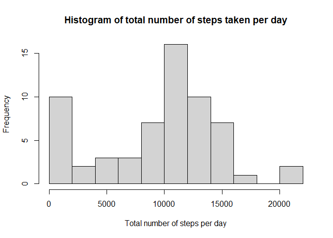
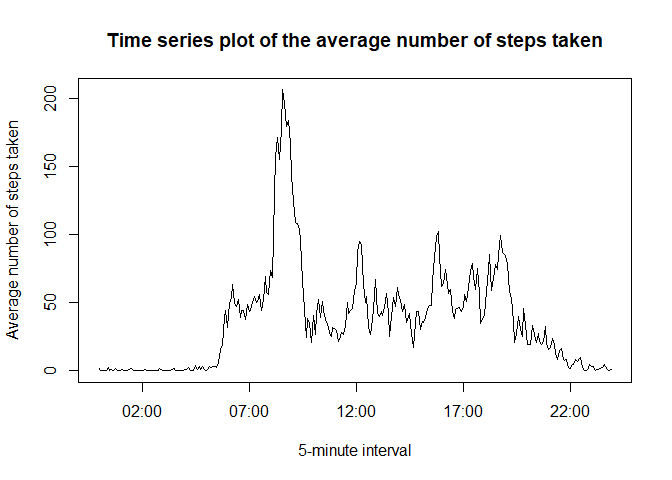
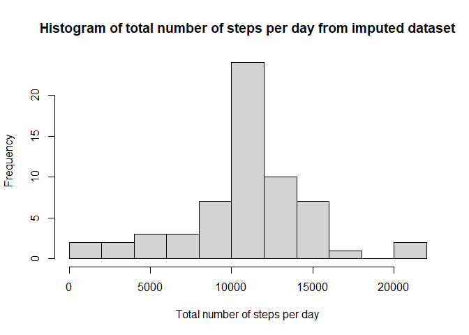
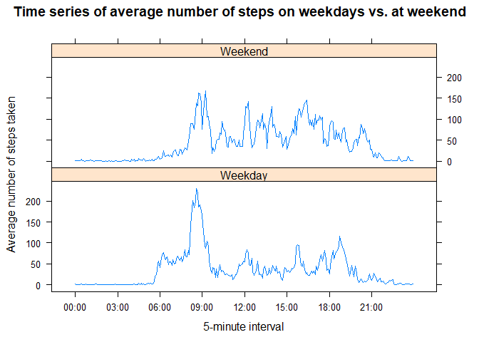

## Loading and preprocessing the data


```r
library(lubridate)
library(plyr)
library(lattice)
raw <- read.csv("./activity/activity.csv")
processed <- raw
processed$date <- as.Date(processed$date)
processed$interval <- sprintf("%04d", processed$interval)
```

Here is how the first few lines of the processed data look:

```r
head(processed,4)
```

```
##   steps       date interval
## 1    NA 2012-10-01     0000
## 2    NA 2012-10-01     0005
## 3    NA 2012-10-01     0010
## 4    NA 2012-10-01     0015
```

## What is mean total number of steps taken per day?

A histogram of the total number of steps taken per day is plotted:


```r
dailyTotal <- ddply(processed, .(date), summarize, total=sum(steps,na.rm=T))
hist(dailyTotal$total, breaks=8,
     main="Histogram of total number of steps taken per day",
     xlab="Total number of steps per day")
```

<!-- -->


```r
dailyMean <- mean(dailyTotal$total)
dailyMedian <- median(dailyTotal$total)
```

The mean of the total numbers of steps per day is: 9354.2295082,  
the median of the total numbers of steps per day is: 10395.

## What is the average daily activity pattern?

A time series of the average number of steps taken during the day is plotted:


```r
intervalMean <- ddply(processed, .(interval), summarize, mean=mean(steps,na.rm=T))
intervalMean$time <- strptime(intervalMean$interval,"%H%M")

plot(intervalMean$time, intervalMean$mean, type="l",
     main="Time series plot of the average number of steps taken",
     xlab="5-minute interval", ylab="Average number of steps taken")
```

<!-- -->

```r
locateMaxMean <- which.max(intervalMean$mean)
timeMaxMean <- format(intervalMean$time[locateMaxMean],"%H hour %M  minute")
```

On average, the maximum number of steps taken happens in the 5-minute interval 
from 08 hour 35  minute.

## Imputing missing values


```r
NArow <- sum(is.na(processed$steps)|is.na(processed$date)|is.na(processed$interval))  
NAsteps <- sum(is.na(processed$steps))
NAdate <- sum(is.na(processed$date))
NAinterval <- sum(is.na(processed$interval))
```

There are 2304 rows containing NA's in the dataset.  
To be exact, there exist 2304 NA's in the column 'steps',
0 in the column 'date', and 0 in the column 'interval'.  

These missing values are to be imputed using the mean of the same 5-minute interval.
The following code does the job:


```r
imputed <- processed
locateNA <- which(is.na(imputed$steps))
for(i in locateNA){
    getrow <- which(intervalMean$interval==imputed$interval[i])
    imputed$steps[i] <- intervalMean$mean[getrow]
}
```

The imputed dataset now looks like the following:


```r
head(imputed,4)
```

```
##       steps       date interval
## 1 1.7169811 2012-10-01     0000
## 2 0.3396226 2012-10-01     0005
## 3 0.1320755 2012-10-01     0010
## 4 0.1509434 2012-10-01     0015
```

A new histogram is plotted using the imputed dataset:


```r
dailyTotalImp <- ddply(imputed, .(date), summarize, total=sum(steps,na.rm=T))
hist(dailyTotalImp$total, breaks=8,
     main="Histogram of total number of steps per day from imputed dataset",
     xlab="Total number of steps per day")
```

<!-- -->


```r
dailyMeanImp <- mean(dailyTotalImp$total)
dailyMedianImp <- median(dailyTotalImp$total)
```

Using the imputed dataset,  
the new mean of the total numbers of steps per day is: 10766.1886792,  
the new median of the total numbers of steps per day is: 10766.1886792.

Upon comparing, the new mean and new median have both increased after the missing
values are imputed.

## Are there differences in activity patterns between weekdays and weekends?

A factor variable 'day' is introduced into the dataset to indicate whether the
day of record is a weekday or during a weekend:


```r
imputed$day <- weekdays(imputed$date)
imputed$day <- ifelse(grepl("Saturday|Sunday",imputed$day), "Weekend", "Weekday")
imputed$day <- factor(imputed$day)
```

A panel plot is made using the lattice plotting system:


```r
intervalMeanImp <- ddply(imputed, .(interval,day), summarize, mean=mean(steps))
intervalMeanImp$time <- as.POSIXct(strptime(intervalMeanImp$interval,"%H%M"))

xTicks <- seq(min(intervalMeanImp$time),max(intervalMeanImp$time), by="3 hour")
xyplot(mean~time|day, data=intervalMeanImp, type="l", layout=c(1,2),
       main="Time series of average number of steps on weekdays vs. at weekend",
       xlab="5-minute interval", ylab="Average number of steps taken",
       scales=list(x=list(at=xTicks, labels=format(xTicks,"%H:%M"))) )
```

<!-- -->
